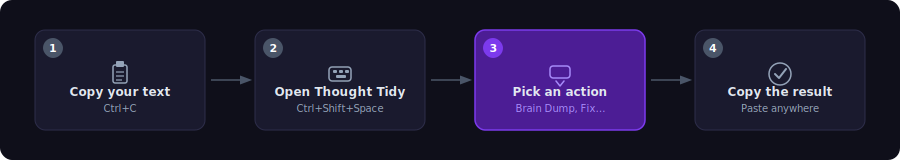
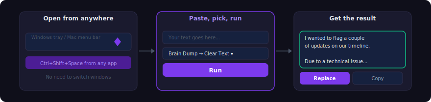
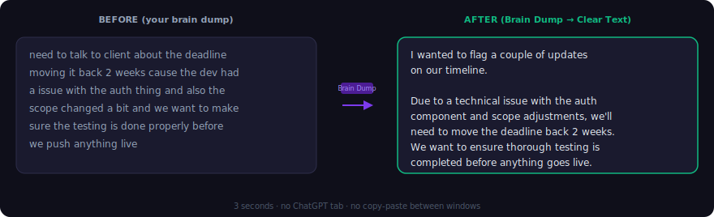
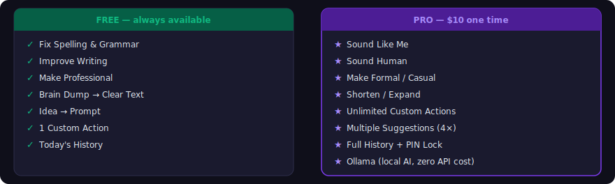
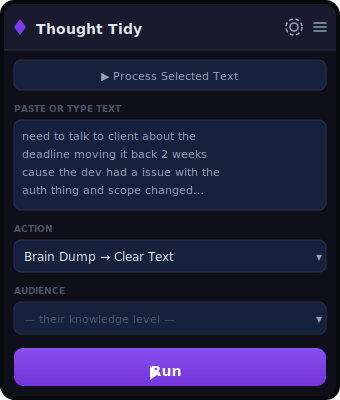
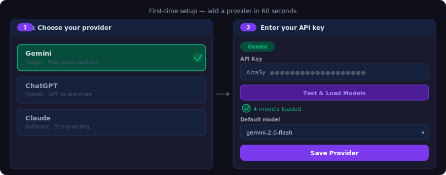
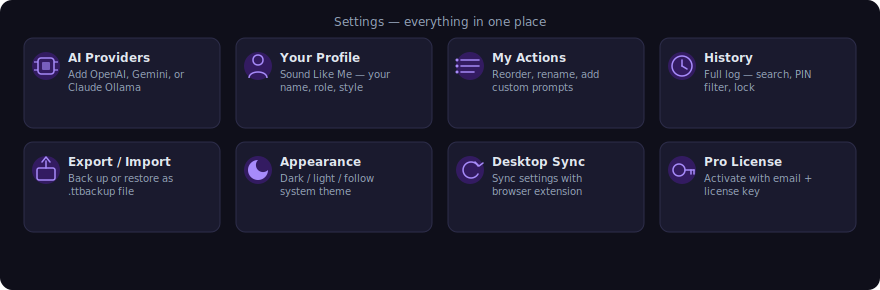
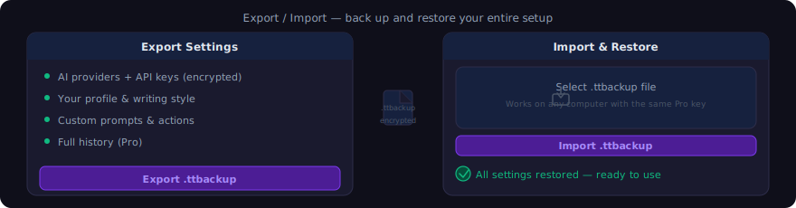

<p align="center">
  
  
  
  
  
</p>

# Thought Tidy

**AI writing assistant for fast thinkers — fix, rewrite, and transform any text in seconds, from any app.**

Highlight text, right-click, pick an action, done. No subscriptions. No accounts. Your API key, your data, nobody watching.

<p align="center">
  <a href="#install--setup">Setup Guide</a> &nbsp;·&nbsp;
  <a href="https://northpandalabs.gumroad.com/l/thought-tidy">Upgrade to Pro — $10</a> &nbsp;·&nbsp;
  <a href="README-Dev.md">Developer Docs</a> &nbsp;·&nbsp;
  <a href="https://github.com/northpandalabs/Thought-Tidy">GitHub</a>
</p>

<p align="center">
  <a href="https://github.com/northpandalabs/Thought-Tidy/releases/latest/download/thought-tidy-chrome.zip"></a>
  <a href="https://github.com/northpandalabs/Thought-Tidy/releases/latest/download/thought-tidy-firefox.zip"></a>
  <a href="https://github.com/northpandalabs/Thought-Tidy/releases/latest/download/Thought.Tidy.Setup.1.5.8.exe"></a>
  <a href="https://github.com/northpandalabs/Thought-Tidy/releases/latest/download/Thought.Tidy-1.5.8-arm64.dmg"></a>
  <a href="https://github.com/northpandalabs/Thought-Tidy/releases/latest/download/Thought.Tidy-1.5.8.AppImage"></a>
</p>

---

## How it works

<p align="center">
  
</p>

<p align="center">
  
</p>

**Desktop app** — works from any application on your computer:

```
1  Copy your text          Ctrl+C
2  Open Thought Tidy       Ctrl+Shift+Space
3  Pick an action          Brain Dump → Clear Text
4  Click Run → Copy        done in seconds
```

**Browser extension** — works on any webpage:
```
1  Select text on any page
2  Right-click → pick an action
3  Result appears inline — Replace or Copy
```

### See it in action

<p align="center">
  
</p>

You paste scattered thoughts → pick **Brain Dump → Clear Text** → you get organized, professional writing. 3 seconds. No ChatGPT tab switching. No copy-pasting between windows.

---

## What it can do

<p align="center">
  
</p>

| Action | What it does | Tier |
| --- | --- | --- |
| **Fix Spelling & Grammar** | Cleans up mistakes, nothing else changed | Free |
| **Improve Writing** | Better clarity and flow, keeps your voice | Free |
| **Make Professional** | Polished, articulate, full meaning preserved | Free |
| **Brain Dump → Clear Text** | Scattered thoughts in, organized writing out | Free |
| **Idea → Prompt** | Turn a vague idea into a ready-to-use AI prompt | Free |
| **Sound Like Me** | Rewrites in *your* voice using your saved profile | Pro |
| **Sound Human** | Removes AI stiffness, sounds like a real person | Pro |
| **Make Formal / Casual** | Shift the tone either direction | Pro |
| **Shorten / Expand** | Adjust the length | Pro |
| **Your Custom Prompts** | Build your own actions — Email Reply, Slack, anything | 1 free · unlimited Pro |

---

## Free vs Pro

<p align="center">
  <a href="https://northpandalabs.gumroad.com/l/thought-tidy"></a>
</p>

| Feature | Free | Pro |
| --- | --- | --- |
| Fix Spelling, Improve, Make Professional, Brain Dump, Idea→Prompt | ✓ | ✓ |
| Today's activity history | ✓ | ✓ |
| 1 custom prompt action | ✓ | ✓ |
| Sound Like Me (Your Profile) | — | ✓ |
| Sound Human, Formal, Casual, Shorten, Expand | — | ✓ |
| Multiple suggestions (up to 4 variants) | — | ✓ |
| Unlimited custom prompts | — | ✓ |
| Full history — all time, searchable, PIN-protected | — | ✓ |
| Grammar sanitizer (no filler, no headings, em-dash control) | — | ✓ |
| Export / Import settings (.ttbackup) | — | ✓ |
| Multi-provider fallback | — | ✓ |
| Ollama (local AI, zero API cost) | — | ✓ |

Pro is a **one-time $10 purchase** — no subscription, no recurring charges. Works on both the extension and desktop app with the same license.

---

## The popup

<p align="center">
  
</p>

Open it with `Ctrl+Shift+Space` from anywhere — browser, email client, Word, Slack, anything. Paste your text, pick an action, click Run. That's the whole interaction.

---

## Sound Like Me

Fill out your profile once — name, role, writing style, context. Enable **Inject into every prompt** and every action now writes for *you specifically*.

**Sound Like Me** rewrites in your authentic voice: not generic AI, not corporate formal. The difference between "Dear Sir/Madam, I hope this email finds you well" and something that actually sounds like you wrote it.

- **Your Name** — personalizes tone
- **Your Role** — roofing contractor, developer, nurse — whatever frames your world
- **Writing Style** — "casual and direct, short sentences, use em-dashes"
- **Personal Context** — bio, who you write to, common topics

Load your profile from a GitHub Gist or any plain-text URL with one click.

---

## Your Privacy & Data Safety

- **No Thought Tidy servers.** Your text goes from your browser or desktop app directly to the AI provider you chose. Nothing passes through our infrastructure.
- **No accounts required.**
- **Local-only storage.** All data stays on your machine — never uploaded anywhere.
- **Encrypted API keys.** Desktop: OS keychain (Windows DPAPI, macOS Keychain). Extension: AES-256-GCM.
- **Local sync only.** Desktop↔extension sync runs over `127.0.0.1` loopback only.
- **Open source.** Read every line at [github.com/northpandalabs/Thought-Tidy](https://github.com/northpandalabs/Thought-Tidy) before installing.

---

## vs. Grammarly

| | Grammarly | Thought Tidy |
| --- | --- | --- |
| Corrects as you type | ✓ | — |
| Rewrites whole passages | limited | ✓ |
| Knows who YOU are | — | ✓ Pro |
| Brain dump → organized text | — | ✓ |
| Turn ideas into AI prompts | — | ✓ |
| Custom prompt actions | — | ✓ (1 free / unlimited Pro) |
| Privacy | their servers | your provider only |
| Monthly cost | $12–15/mo | fractions of a cent per fix |
| Your data | stored by Grammarly | goes only to your chosen AI |

Use Grammarly for inline typo correction. Use this for rewrites, brain dumps, voice, and anything Grammarly can't do.

---

## Get an API key

You need a key from **one** provider. The in-app **API Setup Guide** (Settings → Get API Key Guide) walks through each step with screen examples.

| Provider | Free tier | Get your key |
| --- | --- | --- |
| **Google Gemini** | **Yes — generous monthly quota** | [aistudio.google.com/app/apikey](https://aistudio.google.com/app/apikey) |
| **OpenAI** | No (cheap — ~$0.00015/1K tokens) | [platform.openai.com/api-keys](https://platform.openai.com/api-keys) |
| **Anthropic (Claude)** | No (cheap) | [console.anthropic.com/settings/keys](https://console.anthropic.com/settings/keys) |
| **Ollama** *(Pro)* | Free — runs locally | [ollama.com](https://ollama.com) |

A typical "Fix Spelling" on a paragraph costs less than $0.001. Most users spend under $1/month.

---

## Install & Setup

### Adding your first API key

<p align="center">
  
</p>

### Browser Extension

1. Download `thought-tidy-chrome.zip` or `thought-tidy-firefox.zip` from the [latest release](https://github.com/northpandalabs/Thought-Tidy/releases/latest)
2. **Chrome:** go to `chrome://extensions` → enable **Developer mode** → **Load unpacked** → unzip and select the folder
3. **Firefox:** go to `about:debugging` → **This Firefox** → **Load Temporary Add-on…** → select the `.zip` directly
4. Click the toolbar icon → **Settings** → **+ Add Provider** → paste your API key → **Test & Save**

### Desktop App

1. Download the installer for your platform from the buttons above
2. Run the installer — the app starts in your system tray
3. On first launch, Settings opens automatically — add your API key and close
4. Use `Ctrl+Shift+Space` from anywhere to open the popup

The app checks for updates automatically on launch and every 4 hours.

### What's in Settings

<p align="center">
  
</p>

### Backup and restore (Export / Import)

<p align="center">
  
</p>

Export everything (providers, profile, prompts, history) as an encrypted `.ttbackup` file — useful for switching computers or reinstalling. Import always works; export requires Pro.

> **Building from source?** See [README-Dev.md](README-Dev.md) for build instructions, architecture, test setup, and store publishing.

---

## FAQ

**Which provider should I pick?**
Google Gemini — free tier, generous quota, fast models. Start there.

**How much does it cost to use?**
Fractions of a cent per action. Fixing a paragraph is roughly $0.0003–$0.001. Most users spend under $1/month.

**Is my writing stored anywhere?**
No. All data stays local on your device. Your text is only ever sent to the AI provider you chose (using your own API key) for processing — it goes nowhere else. Thought Tidy has no backend, no database, and no servers. Nothing is stored by us.

**Does it work on every website?**
It injects into all pages. Sites with aggressive CSP may block the inline modal — the action still runs and the result shows in the extension popup.

**What is "Idea → Prompt"?**
You describe a vague idea and Thought Tidy asks clarifying questions to sharpen it, then outputs a clean AI prompt ready to paste into any tool.

**What is "Sound Like Me"?**
A Pro profile — describe yourself once (name, role, style, context) and every action writes in your voice instead of generic AI.

**Multiple computers?**
Yes. Same email and license key — just re-enter it on each machine.

**Can I contribute?**
Yes — PRs, issues, and forks are welcome. See [README-Dev.md](README-Dev.md).

---

## Built by

**North Panda Labs** — [github.com/northpandalabs](https://github.com/northpandalabs)

Source available under the project LICENSE.

